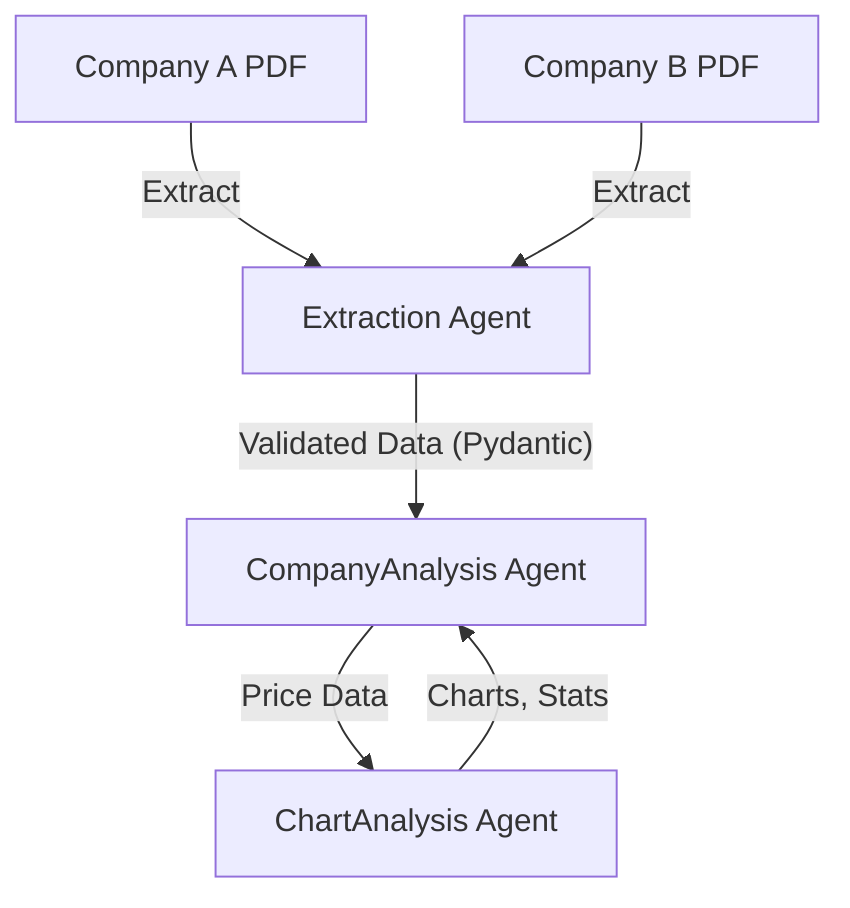

# 📊 Equity Comparison Agent – Professional Quantitative Analysis Toolkit


## 📝 Executive Summary

**Equity Comparison Agent** is a multi-agent system built on the [LlamaIndex](https://www.llamaindex.ai/) framework orchestrating specialized extraction and analysis agents for robust equity research. It performs a comparison analysis using fundamental, technical, and behavioral analytical methods. It is designed to automate the extraction, modeling, and analysis of two companies using both company-specific PDFs with supplemental public data for enhanced narrative, sentiment, financial, and statistical insights. The system leverages:

- 🤖 **LlamaIndex** for agent orchestration and workflow management, enabling modular, scalable, and composable pipelines.
- 🧩 **Pydantic models** for strict data validation and schema enforcement at every stage, ensuring type safety, completeness, and professional auditability.
- 🧠 **OpenAI GPT-4.1/4o** for advanced language and vision-based analysis.
- 🛡️ **Guardrails:** Explicit prompt constraints and schema checks to guard against LLM hallucinations and data fabrication, ensuring agent outputs are reliable and compliant.
- 📝 **Justification Logging:** All agent assumptions, inferences, or speculations are logged and included in the report for full transparency.

This system demonstrates modern quant engineering multi-agent collaboration and schema-driven extraction using a transparent and extensible architecture.

> **Author:** Jake Ransom  
> **License:** Educational Use Only  
> **Disclaimer:** *Not for commercial or investment use. For demonstration and educational purposes only.*

---

## 🏗️ System Architecture: Multi-Agent Orchestration



## 🌟 Key Features

- 🤖 **Automated Data Extraction:** Extracts structured financials and narrative from company earnings decks (PDFs) using LLM-powered custom agents.
- 🕵️ **Smart Ticker Detection:** Detects or infers public equity tickers, even if not explicitly provided in the source documents.
- 💹 **Yahoo Finance Integration:** Supplements extracted data with comprehensive financial metrics, ratios, and company facts from yfinance.
- 🧠 **LLM-Driven Analysis:** Uses OpenAI GPT-4.1/4o to produce a JSON-based, anti-fabrication comparative report including recommendations, key metrics, and detailed company writeups.
- 📝 **Professional Reporting:** Outputs a well-formatted markdown and text report with tables, narrative, and justifications for all analytic choices.
- 🛡️ **Error Handling:** Defensive code ensures missing data is handled gracefully and never fabricated.
- 🧩 **Extensible:** Easily adapt for additional metrics, new data sources, or custom report formats.

## 🗂️ Directory Structure

```plaintext
Equity Comparison Agent/
├── compare.py            # 🚦 Main workflow orchestrator (CLI entry point)
├── graphing_agent.py     # 📈 Technical analysis: raw & VisionGPT
├── pdf_extractor.py      # 📄 Dual PDF extraction: LlamaExtract & PyPDF2+OpenAI
├── requirements.txt      # 📦 Python dependencies (with comments)
├── .env.example          # 🔑 Template for required environment variables
├── reports/              # 📝 Generated charts and analysis outputs
├── Data/                 # 📂 PDFs or data files
└── README.md             # 📚 This documentation
```

---

## 📑 Indexing Methods

- **LlamaIndex Orchestration:** Modular pipelines for extracting structured data and narrative from PDFs using LlamaIndex agents.
- **Hybrid Extraction:** Combines LlamaExtract (LLM-powered) with classic PyPDF2+OpenAI fallback for maximum reliability.
- **Custom Indexing:** Selects between semantic, keyword, and hybrid indexing based on document type, quality, and sector. Ensures robust extraction even from noisy or non-standard PDFs.
- **Schema Validation:** All extracted data is validated against strict Pydantic schemas before entering the analysis pipeline.

---

## 📈 Technical Analysis: VisionGPT & Price Data

- **Visual Pattern Recognition:**
  - Uses VisionGPT to analyze rendered price charts for classic patterns (head & shoulders, double top/bottom, trendlines, breakouts, etc.).
  - Screenshots of price action are passed to VisionGPT for context-aware pattern detection.
- **Raw Price Data Analysis:**
  - Computes technical indicators (SMA, EMA, RSI, MACD, Bollinger Bands, volume, volatility, etc.) directly from price data.
  - Classic rule-based and statistical methods for trend, momentum, and mean reversion signals.
- **Orchestration:**
  - Both visual and raw-data analyses are run in parallel and their findings are cross-validated.
  - All technical signals are logged with confidence scores and justifications.

---

## 🧮 Fundamental & Behavioral Analysis

- **Fundamental Analysis:**
  - Extracts and compares key financial metrics (revenue, margins, EPS, growth, valuation ratios, etc.) using both PDF and yfinance data.
  - Sector-specific logic: Metrics and narrative are tailored based on the sector/industry (e.g., SaaS, manufacturing, biotech, etc.).
- **Behavioral Analysis:**
  - Analyzes management tone, sentiment, and narrative in earnings decks and calls.
  - Detects optimism/pessimism, forward-looking statements, and behavioral cues relevant to investor psychology.
  - Leverages LLMs for nuanced, context-aware behavioral scoring.
- **Combined Approach:**
  - Outputs a comparative table and narrative, highlighting both quantitative and qualitative differences between companies.

---

## 🛡️ Guardrails & Validation

- **Schema Enforcement:** Every agent output is validated against strict Pydantic schemas—no missing or extra fields allowed.
- **Anti-Hallucination:** Prompts explicitly instruct LLMs never to fabricate data; missing values are left blank or flagged for further research.
- **Layered Validation:** Each pipeline stage (extraction, enrichment, analysis, reporting) includes validation checks; errors are logged and surfaced.
- **Auditability:** All steps, inputs, and outputs are logged for traceability and review.

---

## 📝 Justifications & Transparency

- **Assumption Logging:** Every inference, speculation, or assumption made by any agent is logged and included in the final report.
- **Justification Table:** The output report includes a section listing all assumptions, their rationale, and any supporting or missing evidence.
- **Transparency by Design:** Enables users/auditors to trace every analytic decision and data transformation.

---

## ⚙️ Installation

### Prerequisites
- Python 3.10+
- API keys for OpenAI and LlamaCloud
- Access to private modules: `llama_cloud_services`, `llama_cloud`, `llama_index`

### Steps
1. **Clone the repository:**
   ```bash
   git clone <this-repo-url>
   cd Equity\ Comparison\ Agent
   ```
2. **Install dependencies:**
   ```bash
   pip install -r requirements.txt
   ```
3. **Set up API keys:**
   - Create a `.env` file in the project root:
   ```env
   OPENAI_API_KEY=sk-...
   LLAMA_CLOUD_API_KEY=...
   # Add any other required variables
   ```
4. **Add your input files:**
   - Place your PDFs in a `Data/` folder as `companyA.pdf` and `companyB.pdf` (or modify the script to point to your files).

---

## 🚦 Usage

1. **Place your PDFs:** Ensure your two company PDFs are named `companyA.pdf` and `companyB.pdf` in the `Data/` directory.
2. **Run the analysis:**
   ```bash
   python compare.py
   ```
3. **View your results:**
   - `reports/final_comparative_analysis.md` (rich markdown report)
   - `reports/final_comparative_analysis.txt` (plain text)

---

## 📨 Input & Output Details

- **Input:**
  - Two company earnings decks or reports in PDF format, named as above.
  - The script can be modified to accept other filenames or locations if needed.
- **Output:**
  - Markdown and text reports summarizing the comparative analysis, including:
    - Executive summary and recommendation
    - Key metrics comparison table
    - Detailed company-specific analyses
    - Bullet-pointed justifications for metric selection and any assumptions/inferences

---

## 🛠️ Customization & Extensibility

- **Add new metrics:**
  - Update the prompt logic in `compare.py` to instruct the LLM to consider new variables.
- **Change report format:**
  - Modify the markdown template in `compare.py` to adjust section order, styling, or content.
- **Integrate new data sources:**
  - Add new extraction or supplement functions to pull in additional data or alternative financial APIs.

---

## ❓ Troubleshooting & FAQ

- **Q: I get `ModuleNotFoundError` for llama_cloud_services!**
  - A: These are private modules. You must have access (contact the maintainer or your enterprise admin).
- **Q: The script can’t find my PDFs!**
  - A: Make sure your files are named and placed as `Data/companyA.pdf` and `Data/companyB.pdf`.
- **Q: I get API errors!**
  - A: Double-check your `.env` file and API key validity.
- **Q: The output is missing data!**
  - A: The agent never fabricates—missing data means it wasn’t found in your input or yfinance. Check your PDFs and ticker symbols.

---

## ⚠️ Caveats & Disclaimers

- **Strict anti-fabrication:** The agent **never** invents facts. If data is missing, it is left blank or labeled as "Further research needed."
- **Intended use:** For educational and research purposes only. Not investment advice.

---

## 🙏 Credits

Created by Jake Ransom, with LLM-powered extraction and analysis.

---

## 📝 Sample Output

```markdown
# Comparative Equity Analysis: General Motors (GM) vs. Ford (F)

---

## Recommendation
General Motors (GM) is favored due to its stronger margin profile, more disciplined capital structure, and a technical setup that signals emerging relative strength. While Ford (F) offers a higher dividend yield and slightly faster top-line growth, GM's superior profitability, lower valuation multiples, and improving technical momentum provide a more compelling risk/reward for investors seeking both value and operational resilience. Behavioral signals, including more constructive analyst sentiment and management guidance, further reinforce GM's edge at this juncture.


## Key Metrics Comparison
| Metric            | General Motors (GM) | Ford (F) |
|-------------------|-----------------|-----------------|
| Revenue           | $....B           | $....B           |
| Operating Income  | $....B           | $....B           |
| EPS               | $....          | $....           |
| Market Cap        | $....B            | $....B            |
...

## Comparative Analysis
Both GM and Ford operate in the highly cyclical auto manufacturing sector, but GM distinguishes itself with a more robust margin structure and a notably lower leverage profile. GM's profitability metrics, including gross and operating margins, outpace Ford's, reflecting better cost control and operational efficiency. While Ford edges ahead in revenue growth, this comes at the expense of margin compression and a significantly higher debt-to-equity ratio, which could amplify risk in a downturn.....

## Detailed Analysis: General Motors (GM)
[Full company-specific writeup and 2yr Price Chart]

## Detailed Analysis: Ford (F)
[Full company-specific writeup and 2yr Price Chart]

### Justifications
[Reasoning for any decisions, speculations, or inferences]
```markdown
---

